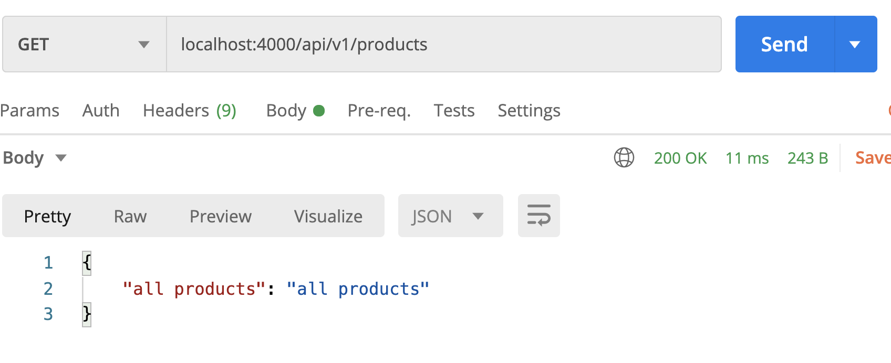
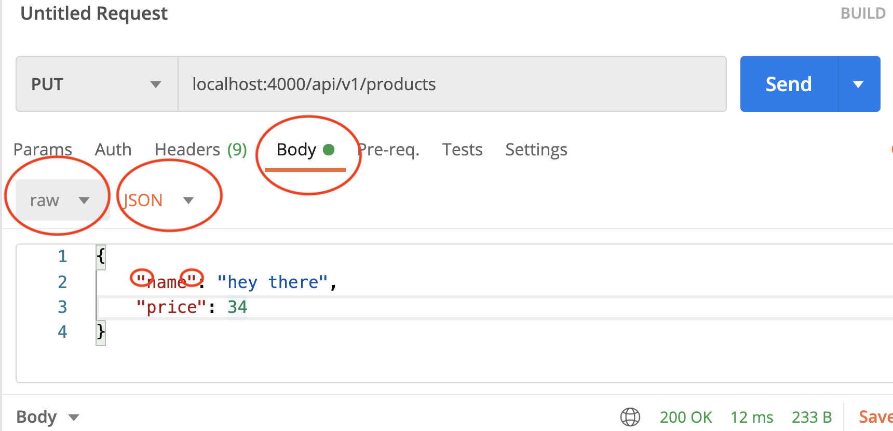

# api-ex

## This repo has our One-to-Many db example from previously.

## Let's turn this into an API

Here is what we have set up in our controllers/products.js
```javascript
const express = require('express')
const router = express.Router()

router.get('/', (req, res)=> {
  // show all products
  console.log('all products')
  res.json({ "all products": "all products" })

})

router.get('/:id', (req, res)=> {
  // get one product by id
  console.log('one product')
  res.json({ "one product": "one product" })
})

router.post('/', (req, res)=> {
  console.log(req.body)
  //create a new product
  console.log('created product')
  res.json({ "created": "nothing created yet" })
})

router.put('/', (req, res)=> {
  console.log(req.body)
  //update a product
  console.log('updated product')
  res.json({ "updated": "updated" })
})

module.exports = router
```

We need to update these so that we actually interact with our database.
What steps do you need to take to have access to the database inside this folder?

-----

So let's bring it in at the top. Let's also edit our routes so that we can use **async / await**.

Make a request via Postman at the correct route to show all products.



Great, so this is working, but right now we don't have any products in our database. We could use our dbPlayground, but let's go ahead and use Postman to make the POST request with some JSON body.

First let's make sure our post route is set up to make a creation to the database using req.body to get our information.

Next when that is set up, lets go ahead an create our **post** using **Postman**. 


Notice the things circled in the picture above. Double quotes, this is JSON. make sure you have the drop downs of **raw** and **JSON** as well. By default it may be set to text.

Make a few post requests, and then re-test our **index** route that get's **all** of the products.

## Your Turn
Take 10 minutes to see if you can get the **show** route working. If you finish that up, move on to PUT, and DELETE.


Thats CRUD!

Now you will do this with a partner on a different model you create.
